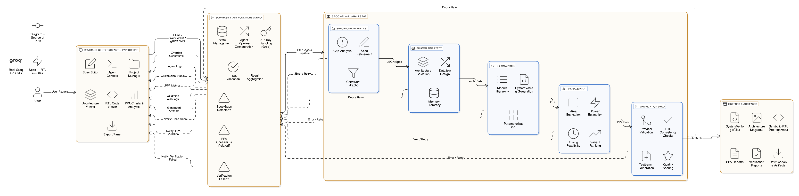

# ⚡ ForgeVeda — Agentic Hardware Development Platform

---

Live link:- [ForgeVeda](https://forgeveda-git-main-harsh-patels-projects-0485ee76.vercel.app/)

## ⚠️ Important Disclaimer

**Before exploring the web application in this repository, please note:**

ForgeVeda is a specialized IDE for hardware architects. This web-based implementation provides an end-to-end agentic workflow to compress the silicon design lifecycle. While the core "Front-End" of hardware design (spec to RTL) is automated, the generated code and architectures should be validated against specific target process node PDKs.

**API Selection Rationale:**

We chose **Groq API** as our primary LLM provider after extensive evaluation during development. Groq emerged as the optimal choice for this project based on the following critical criteria:

1. **Token Limits**: Generous context windows (up to 8,000 tokens) suitable for processing dense architectural specifications and generating complex SystemVerilog without aggressive truncation.
2. **Response Times**: Minimal cooldown periods between API calls, enabling rapid sequential agent execution (transitioning through 5 specialized agents in ~30–60 seconds).
3. **Developer Experience**: Straightforward API design with robust JSON mode support, which is critical for structured agent-to-agent data transfer and reliable parsing of hardware components.
4. **Cost Efficiency**: High throughput and low latency at a competitive price, making it accessible for rapid prototyping and iterative hardware exploration.

While other LLM providers were considered, Groq's combination of performance, reliability, and accessibility made it the best fit for this autonomous multi-agent system. Users are welcome to explore alternative providers by modifying the API integration layer in `supabase/functions/chip-architect/index.ts`.

---

## 📑 Table of Contents

### Getting Started
- [Abstract](#abstract)
- [Problem Statement](#problem-statement)
- [Proposed Solution](#proposed-solution)

### Architecture & Design
- [System Architecture](#system-architecture)
  - [High-Level Architecture](#high-level-architecture)
  - [Detailed Data Flow](#detailed-data-flow)
  - [Scalability & Modularity](#scalability--modularity)

### Technical Deep Dive
- [Autonomous & Agentic Components](#autonomous--agentic-components)
  - [Agent 1: Specification Analyst (Concept Extraction)](#1-specification-analyst-agent)
  - [Agent 2: Silicon Architect (Knowledge Structuring)](#2-silicon-architect-agent)
  - [Agent 3: RTL Engineer (Design Generation)](#3-rtl-engineer-agent)
  - [Agent 4: PPA Validator (Constraint Evaluation)](#4-ppa-validator-agent)
  - [Agent 5: Verification Lead (Validation & Self-Checking)](#5-verification-lead-agent)
  - [Agent Orchestration](#agent-orchestration--data-flow)

### Features & Capabilities
- [Features](#features)
  - [Core Functionality](#core-functionality)
  - [Chip Support](#chip-support--specialties)
  - [Analytics & Visualization](#analytics--visualization)
  - [Export & Sourcing](#export--sourcing)
  - [User Experience](#user-experience)

### Implementation Details
- [Technology Stack](#technology-stack)
- [Setup & Installation](#setup--installation)
- [Usage Instructions](#usage-instructions)

### Evaluation & Quality
- [Evaluation Criteria Alignment](#evaluation-criteria-alignment)

### Future Development
- [Limitations & Future Improvements](#limitations--future-improvements)

### Project Information
- [Team Information](#team-information)
- [License](#license)
- [Additional Resources](#additional-resources)

---

## Abstract

ForgeVeda is an autonomous AI system designed to solve the challenge of transforming high-level hardware specifications into synthesizable SystemVerilog (RTL). Built for **AutonomousHacks 2026**, this project demonstrates true agentic workflows through architectural decomposition, PPA (Power-Performance-Area) ranking logic, and self-checking mechanisms. The system employs five specialized AI agents that autonomously process chip specifications through a sequential pipeline: analyzing gaps in specs, building hierarchical hardware structures, generating industry-standard RTL, evaluating physical constraints, and validating design integrity—all without human intervention in the execution cycle.

## Problem Statement

**Challenge**: Autonomous Silicon Architect + RTL Generator

Hardware design teams face a critical bottleneck: the "Front-End" gap between a text document and the first synthesizable module. The manual process requires:

1. **Gap Analysis**: Reading hundreds of pages of specs to identify physical impossibilities or missing power budgets.
2. **Architectural Exploration**: Comparing multiple topologies (e.g., Systolic Array vs. SIMD) to find the best PPA fit.
3. **RTL Coding**: Manual creation of thousands of lines of boilerplate SystemVerilog.
4. **Constraint Ranking**: Objectively evaluating which design variant best fits the 7nm/5nm process nodes.
5. **Logic Validation**: Self-checking that the generated RTL actually implements the intended dataflow.

**Why This Requires Agentic AI**:

- **Decomposition**: The silicon design flow naturally decomposes into distinct sub-tasks (Analysis → Architecture → Implementation → Evaluation → Validation), each requiring specialized domain expertise.
- **Complexity Reasoning**: PPA estimation demands contextual reasoning about gate counts, clock domains, and memory hierarchies—not simple template filling.
- **Self-Checking**: The system must autonomously identify combinational loops or CDC (Clock Domain Crossing) issues in its own code before delivering it to the user.

---

## Proposed Solution

ForgeVeda implements a **five-agent autonomous pipeline** using Groq's LLaMA 3.3 70B model, where each agent operates with a specific hardware engineering persona:

### Agent Pipeline Architecture

**Agent 1: Specification Analyst (Concept Extraction)**
- Autonomously parses natural language chip specs.
- Identifies 5-10 critical performance targets (TOPS, BW, Power).
- Performs "Gap Analysis" to find missing constraints.
- Output: Structured JSON of refined specifications.

**Agent 2: Silicon Architect (Knowledge Structuring)**
- Receives refined specs and determines top-level dataflow.
- Selects memory hierarchies, bus protocols, and compute unit counts.
- Constructs a hierarchical component tree representing the chip's "Skeleton".

**Agent 3: RTL Engineer (Design Generation)**
- Translates the structured architecture into synthesizable SystemVerilog.
- Generates Control logic, Datapath, and Interface modules.
- Ensures proper parameterization for area-efficient design.

**Agent 4: PPA Validator (Constraint Evaluation)**
- Autonomously evaluates the design against the target process node.
- Estimates Area ($mm^2$), Power ($W$), and Critical Path ($ns$).
- Ranks variants to identify the most feasible implementation.

**Agent 5: Verification Lead (Validation & Self-Checking)**
- Verifies design integrity and protocol compliance.
- Check for "Consistency Errors" between the RTL logic and the original spec.
- Generates testbenches and reports quality scores (0-100).

---

## System Architecture

## System Flowchart




### High-Level Architecture

```
┌─────────────────┐
│  Command Center │ (React + TypeScript)
│  - Spec Editor  │
│  - Agent Logs   │
│  - PPA Charts   │
└────────┬────────┘
         │
         ▼
┌─────────────────────────────────────────┐
│     Supabase Edge Function (Deno)       │
│  - Pipeline Orchestration               │
│  - Groq Service Integration             │
│  - State Management                     │
└────────┬────────────────────────────────┘
         │
         ▼
┌─────────────────────────────────────────┐
│        Groq API (LLaMA 3.3 70B)         │
│  Agent 1: Gap Analysis                  │
│  Agent 2: Arch Synthesis                │
│  Agent 3: RTL Generation                │
│  Agent 4: PPA Estimation                │
│  Agent 5: Design Validation             │
└────────┬────────────────────────────────┘
         │
         ▼
┌─────────────────────────────────────────┐
│         Front-End Display               │
│  - Code Mirror Web Editor               │
│  - Recharts PPA Distribution            │
│  - Export (SystemVerilog, PDF Report)   │
└─────────────────────────────────────────┘
```

---

## Autonomous & Agentic Components

### 1. Specification Analyst Agent
**Focus**: Identifying ambiguities in hardware intent.
**Action**: If a user asks for an "AI Accelerator" but forgets to specify precision (INT8/FP16), the agent autonomously flags this as a critical gap and suggests industry standard values based on the use case.

### 2. Silicon Architect Agent
**Focus**: Structural decomposition of the chip.
**Action**: Decisions on whether to use a "Systolic Array" for matrix multiplications or a "SIMD Vector Processor" based on the balance between TOPS and Power limits.

### 3. RTL Engineer Agent
**Focus**: Implementation of synthesizable logic.
**Action**: Writing SystemVerilog that uses non-blocking assignments, proper reset signals, and parameter-based modules that can be scaled by the user.

### 4. PPA Validator Agent
**Focus**: Physical constraint checking.
**Action**: Uses internal heuristics to estimate if the generated design will fit within the user's "Power Budget". It ranks three different variants: "Performance Optimized", "Area Optimized", and "Balanced".

### 5. Verification Lead Agent
**Focus**: Self-assessment and quality control.
**Action**: Performs an "Internal Review" of the RTL code. If it detects a missing "Ready/Valid" handshake in a FIFO, it flags the design for review before the user even downloads it.

---

## ✨ Features & Capabilities

- **🚀 Instant RTL Synthesis**: Go from a text specification to thousands of lines of SystemVerilog in under 60 seconds.
- **📊 PPA Analytics**: Interactive charts showing Power, Performance, and Area trade-offs.
- **🛡️ Built-in Verification**: Autonomous testbench generation for immediate simulation.
- **🧩 Chip Personas**: Tailored agents for AI Accelerators, CPUs, GPUs, DSPs, and Networking chips.
- **📂 Project Management**: Integrated "Command Center" to manage multiple design iterations.

---

## 🛠️ Implementation Details

### Technology Stack
| Layer | Technology |
|-------|------------|
| UI Framework | React + Vite |
| Styling | Tailwind CSS + Shadcn UI |
| Logic/Backend | Supabase Edge Functions |
| LLM Engine | Groq (Llama-3.3-70b-versatile) |
| Animations | Framer Motion |

---

## Team Information

**Team Name**: AML

**Team Members**:
- **Harsh Patel** (GitHub: [@Codewithharsh1326](https://github.com/Codewithharsh1326))
- **Dharm Dave** (GitHub: [@Code-With-Dharm](https://github.com/Code-With-Dharm))
- **Gauri Mathur** (GitHub: [@gaurimathur0108](https://github.com/gaurimathur0108))

**Hackathon**: AutonomousHacks 2026

---

## License
Licensed under the MIT License. Developed with ❤️ by the ForgeVeda Team.
